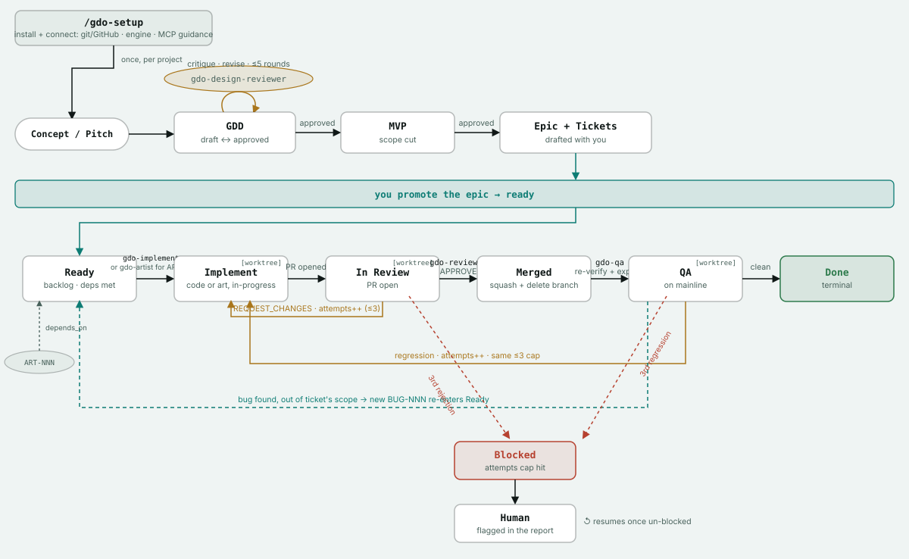

# Game Development OS

An engine-agnostic Claude Code orchestration framework for running a game's
production pipeline end-to-end.

- **You drive the top of the funnel**: `/gdo-gdd`, `/gdo-mvp`, and
  `/gdo-epic` walk you through writing the Game Design Document, scoping the
  MVP, and breaking approved scope into epics and tickets. A GDD draft must
  pass a critique from the `gdo-design-reviewer` agent — a skeptical,
  independent game-designer persona — before it can be approved and MVP
  scoping unlocks.
- **The framework drives execution**: once you promote an epic to `ready`,
  `/gdo-run` works through its tickets autonomously — implement, open a real
  GitHub PR, review, iterate on feedback, merge, QA-test — looping until the
  epic is done. It only comes back to you when the epic finishes, a ticket
  fails repeatedly, or a decision needs your judgment.

See `CLAUDE.md` for the ticket/epic schema, status machine, and conventions
the skills and agents rely on. The diagram above is a static export of the
interactive version (`gdo-orchestration-diagram.html`) — same content,
open the HTML file for the styled page with a legend and the full
who-does-what table alongside it.

## Using this on an actual game project

This repo is the framework's own home — its dogfood/smoke-test data lived
here during development and was cleaned out once it had done its job (see
git history if you want the play-by-play). `/gdo-setup
<path-to-your-project>` installs the framework into a separate game
project. Run that from here, then open a new session *in* the
target project and run `/gdo-setup` again (no arguments) to finish
connecting it: git/GitHub (a real requirement — every stage past
`/gdo-implement` depends on real `gh pr` calls), engine detection, and
optional, always-skippable guidance on connecting an engine MCP server if
one's available for your engine. See `CLAUDE.md`'s art pipeline section and
`.claude/skills/gdo-setup/SKILL.md` for detail.

## Capabilities

- **Design funnel** (`/gdo-gdd`, `/gdo-mvp`, `/gdo-epic`) — you drive it,
  conversationally. A GDD draft must pass a critique from
  `gdo-design-reviewer` — a skeptical, independent game-designer persona —
  before it can be approved and MVP scoping unlocks.
- **Autonomous execution** (`/gdo-run`) — once you promote an epic to
  `ready`, `gdo-orchestrator` works through its entire ticket queue on its
  own: implement, open a real GitHub PR, review, iterate on feedback (capped,
  shared budget between review rejections and QA regressions), merge,
  QA-test, repeat — resuming each item at whatever stage it's actually at.
  Only comes back to you when the epic finishes, something fails
  repeatedly, or a decision needs your judgment. Single-ticket triggers
  (`/gdo-implement`, `/gdo-review`, `/gdo-qa-run`) exist standalone too, for
  handling one item by hand.
- **Art pipeline** (`ART-NNN` tickets, `gdo-artist`) — a code ticket that
  needs an asset `depends_on` an art ticket for it, same mechanism as any
  other dependency. Default is always an autonomously-generated original
  placeholder (a "missing texture" checkerboard PNG or silent WAV, stdlib
  only, zero licensing risk) — never a search for or fabrication of real
  third-party art, and never a blocker. Runs through the exact same
  implement → review → merge → QA cycle as code.
- **Status at a glance** (`/gdo-board`) — leads with a `NEEDS ATTENTION`
  section (blocked items, anything near its rework cap) before the
  per-epic detail.

Verified for real, not just written: the full loop has run unattended
against this repo's own smoke-test epic, including a seeded reject → fix →
re-review cycle and a QA pass that found and filed a genuine bug — see the
git history for the play-by-play.

Requires Python 3.8+ on PATH for the board/art tooling — independent of
whatever engine/language the game itself uses.
